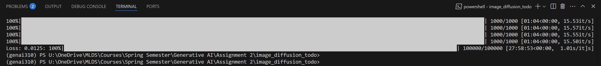

```text
.
├── GenAI_Assignment2_report_upd.pdf
├── LICENSE
├── requirements.txt
├── 2d_plot_diffusion_todo/
│   ├── chamferdist.py
│   ├── cover.png
│   ├── dataset.py
│   ├── ddpm.py
│   ├── ddpm_tutorial.ipynb
│   ├── network.py
│   └── figures/
│       ├── heart_target_prior.png
│       ├── heart_noising.png
│       ├── heart_loss_curve.png
│       ├── heart_chamfer_training.png
│       ├── heart_ddpm_samples.png
│       ├── swiss_roll_noising.png
│       ├── swiss_roll_loss_curve.png
│       ├── swiss_roll_chamfer_training.png
│       ├── swiss_roll_ddpm_samples.png
│       ├── sierpinski_noising.png
│       ├── sierpinski_loss_curve.png
│       ├── sierpinski_chamfer_training.png
│       └── sierpinski_ddpm_samples.png
└── image_diffusion_todo/
    ├── dataset.py
    ├── module.py
    ├── model.py
    ├── network.py
    ├── sampling.py
    ├── scheduler.py
    ├── test.py
    ├── train.py
    ├── fid/
    │   ├── inception.py
    │   └── measure_fid.py
    └── results/
        └── 8_final_samples/
            ├── 0.png
            ├── 1.png
            ├── 2.png
            ├── 3.png
            ├── 4.png
            ├── 5.png
            ├── 6.png
            ├── 7.png
            ├── 8_samples.png
            ├── fid_score.png
            └── training_done_100k.png
```
---

## 1. 2D Diffusion Experiments

<p align="left">
  
</p>


A simple DDPM (an MLP of TimeLinear layers) learns to recover the heart‐shaped target from Gaussian noise.  See `2d_plot_diffusion_todo/ddpm_tutorial.ipynb` for details, including forward noise trajectories and Chamfer‐distance plots.

---

## 2. AFHQ Image Diffusion

Trained on **64×64** AFHQ (cats, dogs, wildlife) for **100 000** steps on an **NVIDIA RTX 3060** (≈28 h).

<p align="left">
  
</p>


**Final Inference Samples (first 8)**  

<p align="left">
  
</p>


**FID** = 9.64  


---

## Reproduce

1. **Create environment**  
   ```bash
   conda create -n genai310 python=3.10
   conda activate genai310
   pip install -r requirements.txt
   ```

2. **2D diffusion**
   ```bash
   cd 2d_plot_diffusion_todo
   jupyter notebook ddpm_tutorial.ipynb
   ```
3. **AFHQ image diffuison**
   ```bash
   cd image_diffusion_todo
   python dataset.py
   python train.py --gpu 0 --train_num_steps 100000
   python sampling.py --gpu 0 --ckpt_path results/.../last.ckpt --save_dir results/final_samples
   python fid/measure_fid.py data/afhq/eval results/final_samples
   ```
